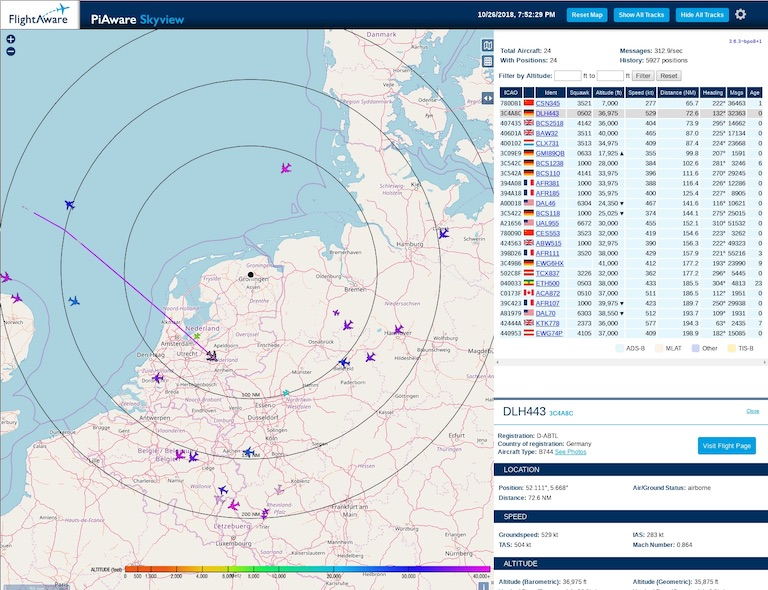
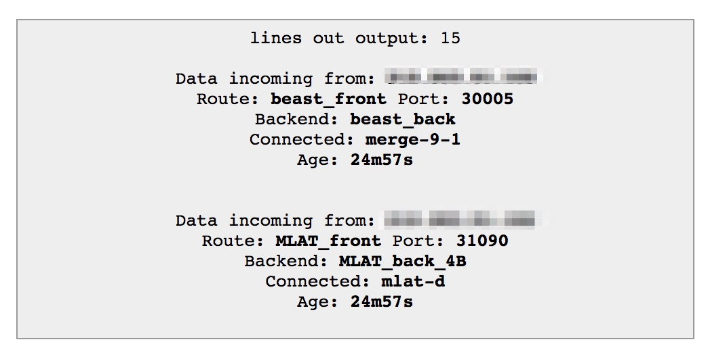

# ADS-B Exchange Docker


[](https://github.com/marcelstoer/docker-nodemcu-build/blob/master/LICENSE)

ADS-B Exchange feeder & MLAT Docker images for Arm (e.g. Raspberry Pi) and x86-64 architectures. Also contains a Docker Compose file that runs all required containers for ADS-B Exchange in one go.

## tl;dr

```
$ git clone https://github.com/marcelstoer/adsbexchange-docker
$ vi docker-compose.yaml
```
You need to edit [`docker-compose.yaml`](docker-compose.yaml) to add geo coordinates of your receiver and its name.

```
$ docker-compose up -d
```

This will pull and start three containers:

- [dump1090-fa](https://github.com/flightaware/dump1090); the ADS-B decoder from [https://github.com/jeanralphaviles/dump1090-docker](https://github.com/jeanralphaviles/dump1090-docker)
- My [ADS-B Exchange feed](https://hub.docker.com/repository/docker/marcelstoer/adsbexchange-docker-feed); the classic beast feeder, source in this repo, multi-arch image on Docker Hub
- My [ADS-B Exchange MLAT](https://hub.docker.com/repository/docker/marcelstoer/adsbexchange-docker-mlat); the optional MLAT feeder, source in this repo, multi-arch image on Docker Hub

The first container also starts PiAware Skyview at [http://localhost:8080](http://localhost:8080)


If you now go to [https://www.adsbexchange.com/myip/](https://www.adsbexchange.com/myip/) it should report your two feeders after a minute or two.


## Background
If you are new to ADS-B, flight tracking, etc. I suggest you read the [great primer](https://tomverbeure.github.io/2019/05/11/ADSB-Exchange-Feeder.html) by [@tomverbeure](https://github.com/tomverbeure).

### Setup

[I am running a LoRaWAN gateway](https://frightanic.com/iot/build-a-lorawan-gateway-for-the-things-network/) feeding to [The Things Network (TTN)](https://www.thethingsnetwork.org/) on the roof of my house. It is based on a Raspberry Pi 2B that runs Docker. Hence, the gateway software is isolated in [an image](https://github.com/netceteragroup/rpi-ttn-gateway) I built with a colleague at work.

Since I have all the "infrastructure" on the roof (RPi, electricity, internet access, IP65 enclosure) it seemed like a no-brainer to add ADS-B capabilities to that device. Two requirements were clear from the beginning:

- For the reasons outlined on their [homepage](https://www.adsbexchange.com/) I will only feed data to ADS-B Exchange and not FlightRadar24, FlightAware, ADSBHub or others.
- All software required to feed to ADS-B Exchange must run in Docker containers.

The hardware was the easy part. I bought a [FlightAware Pro Stick Plus](https://amzn.to/2qT3Rq4) for $20, the excellent [FlightAware 1090 MHz antenna](https://amzn.to/2RUXSfG) for $40 and a [5m low loss cable](https://amzn.to/34oZTmS) for $15.

### Software

tbc...

## Build your own images

If you want to tinker with the Docker files and build your own images follow the path below.

```
$ git clone https://github.com/marcelstoer/adsbexchange-docker
$ cd adsbexchange-docker
$ cd adsbexchange-docker-feed
$ docker build -t adsbexchange-docker-feed .
$ docker run --rm -d -e "INPUT=decoder:30005" —link dump1090:decoder --name adsbexchange-feed adsbexchange-docker-feed
$ cd ../adsbexchange-docker-mlat
$ docker build -t adsbexchange-docker-mlat .
$ docker run --rm -d -e "INPUT=decoder:30005" -e "MLAT_RESULTS=decoder:30104" -e "RECEIVER_LATITUDE=nn.mmmmm" -e "RECEIVER_LONGITUDE=nn.mmmmm" -e "RECEIVER_ALTITUDE=nnnn" -e "RECEIVER_NAME=my-fantastic-ADS-B-receiver" --link dump1090:decoder --name adsbexchange-mlat adsbexchange-docker-mlat
```

## Pending item
- Dockerize the ADS-B Exchange stats application [https://github.com/adsbxchange/adsbexchange-stats](https://github.com/adsbxchange/adsbexchange-stats).
